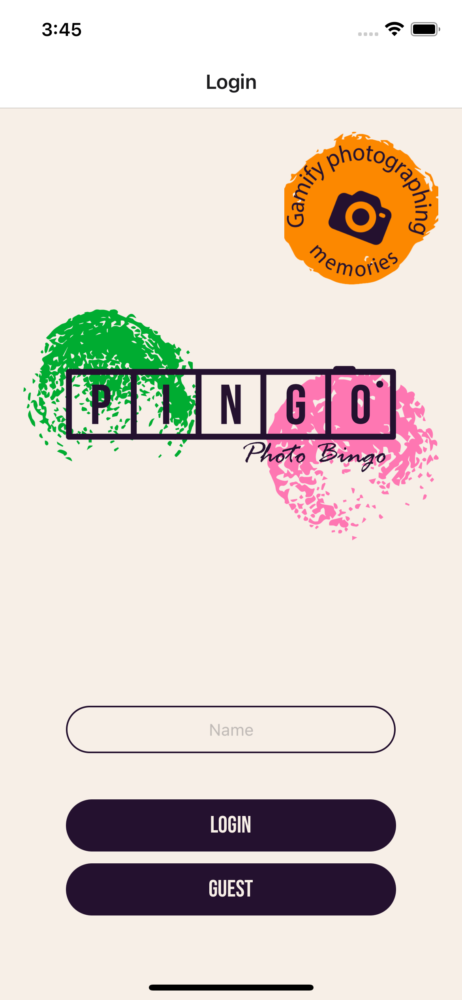
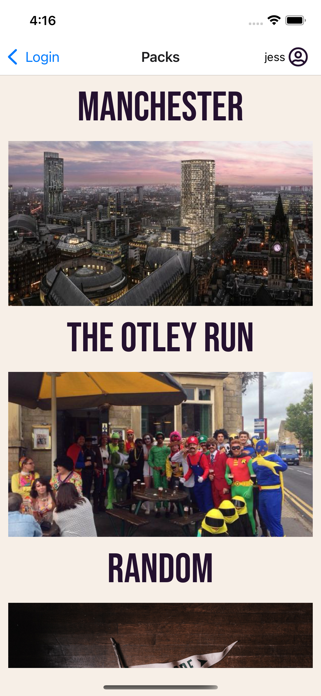
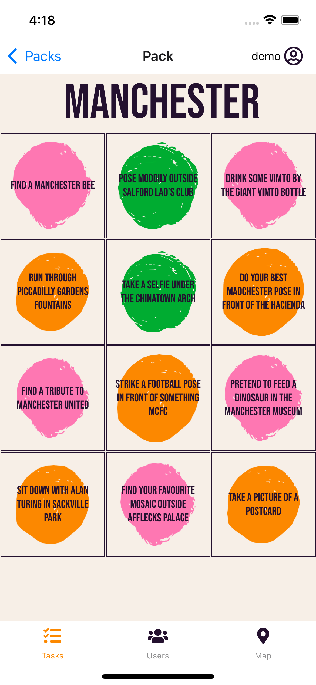
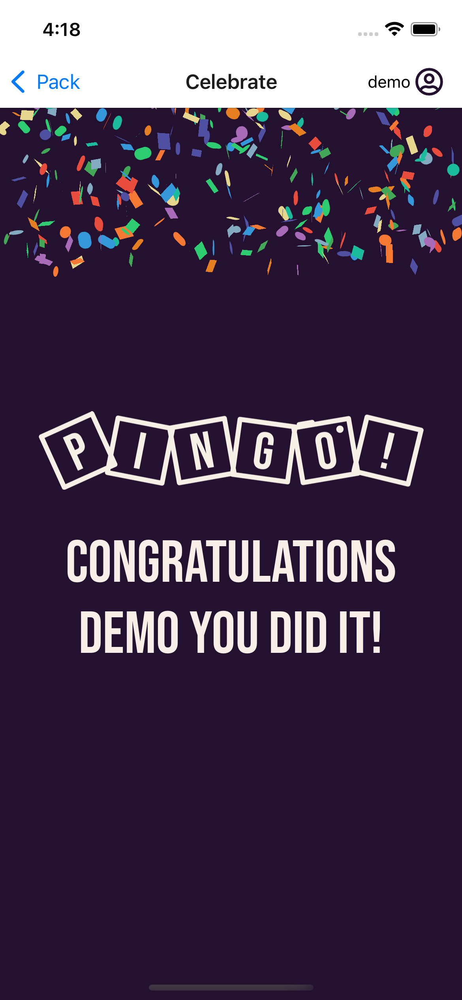
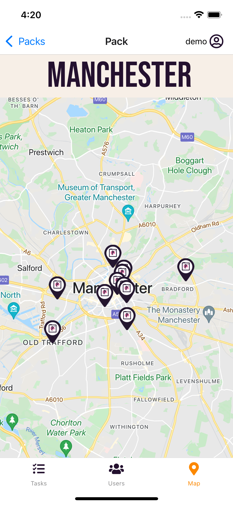
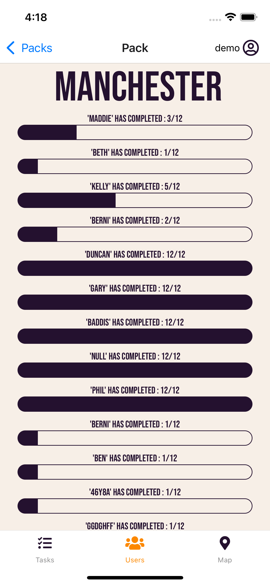

# Pingo

This is the final project for Northcoders full-stack software development bootcamp consisting of: [Ben](https://github.com/baddis01/), [Duncan](https://github.com/duncan-s-white), [Jess Wilson](https://github.com/jesswils/), [Agnieszka](https://github.com/Izdrathi), [Berni](https://github.com/BerniHarris) and [Adam](https://github.com/adamgrime).

**Pingo** is a photo bingo mobile application built with React Native and Firebase. It mixes the excitement of a photo scavenger hunt with the novelty of a classic bingo game!








## How does it work?

Designed to encourage people to explore and photograph their adventures, Pingo prompts users to visit certain attractions or look out for specific items in order to get a “dab” on their bingo card.

There are a selection of packs to choose from, each with their own theme and custom challenges. When you’re ready to play, click on the challenge you want to complete, take a picture, and receive your first bingo dab!

When all tasks are completed on the bingo card, a confetti animation pops onto the screen congratulating you! It wouldn’t be Bingo without a little colourful fanfare after all!

There are other fun features too: Users are able to view the progress of other players, wherever you take a picture the app places a geolocation marker which you can view and you can also go back to any packs you've played and view the pictures you’ve taken.

---

## How to get started

Step 1 - Install Expo Go on your iOS or Android device:

For iOS: https://apps.apple.com/us/app/expo-go/id982107779

For Android: https://play.google.com/store/apps/details?id=host.exp.exponent&hl=en_GB&gl=US

Step 2 - Scan this QR code:


## Or to view the project locally

Do the following to clone the project, install the dependencies and start the server:

```
git clone https://github.com/baddis01/Pingo-Final-Project.git
cd Pingo-Final-Project
npm i
npm start
```
